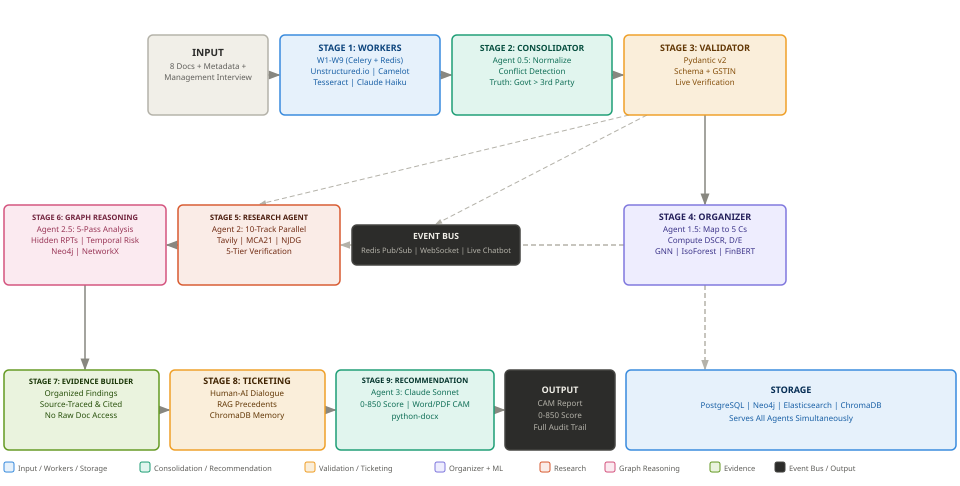
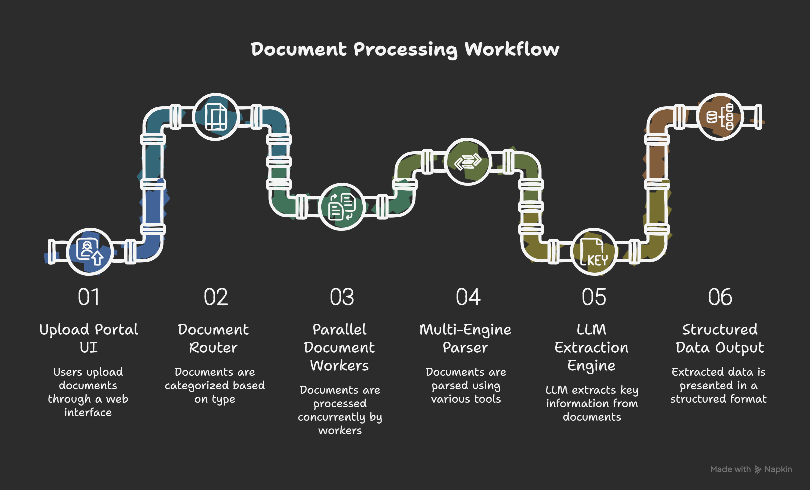
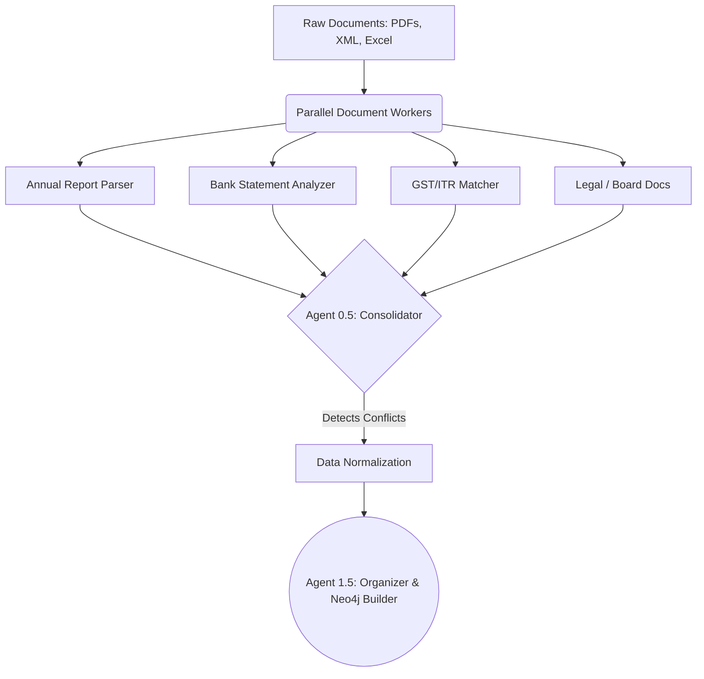
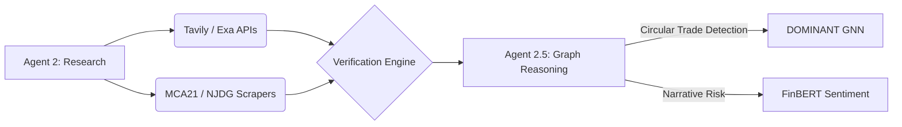
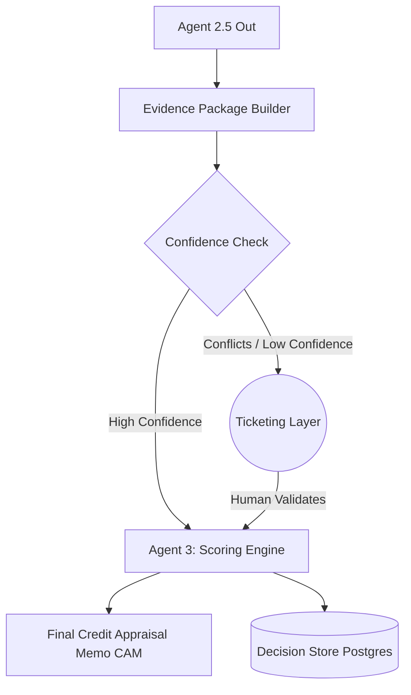
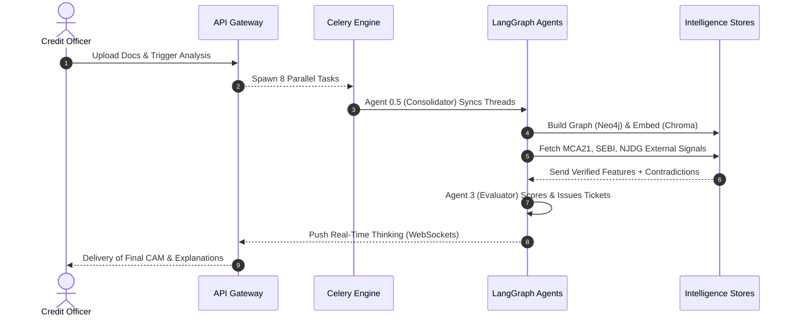
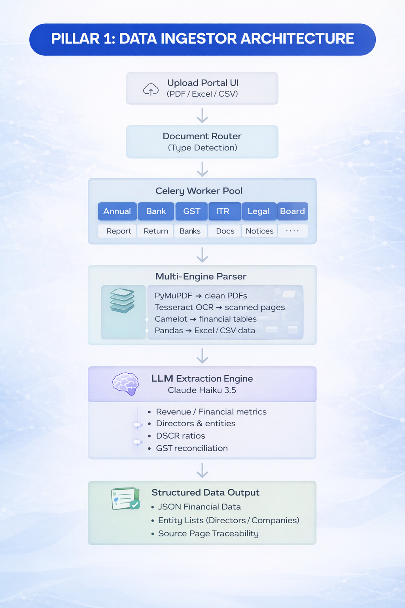
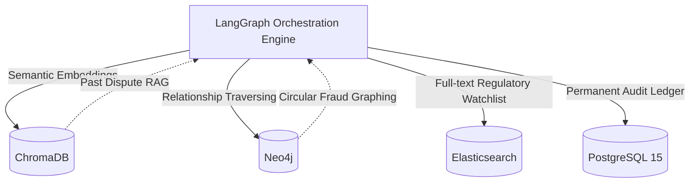
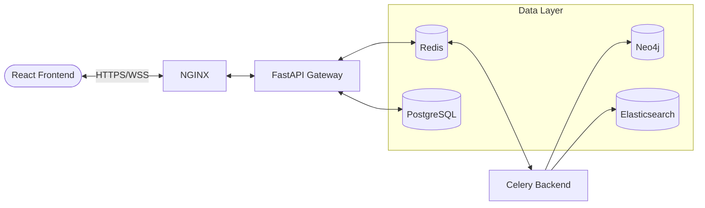

# 🏦 INTELLI-CREDIT — AI-Powered Credit Decisioning Engine

<div align="center">
  
</div>

> An end-to-end intelligent credit appraisal system that transforms weeks of manual document review into a fully transparent, AI-driven pipeline completing in under 4 minutes.

---

## 🌟 What It Solves

<div align="center">
  
</div>

Intelli-Credit automates the generation of **Credit Appraisal Memos (CAMs)** for the banking sector by ingesting corporate loan documents, performing automated deep-research, detecting fraud, and scoring borrowers—while retaining 100% visible AI reasoning.

| Traditional Process | Intelli-Credit |
| --- | --- |
| 2–3 weeks manual review | < 4 minutes end-to-end |
| Single-analyst perspective | 8 parallel workers + 5 research tracks |
| Black-box decisions | 100% fully-cited, traceable AI logic |

---

## 🏗️ Architecture & Core Layers

Intelli-Credit operates on a 9-Stage Pipeline divided into three core pillars: **Data Ingestion**, **Research Intelligence**, and the **Recommendation Engine**.

### 1. Data Ingestion & Organization Layer
*Extracts, normalizes, and resolves conflicts across unstructured documents.*



### 2. External Research & Graph Reasoning Layer
*Fetches real-time market data, scrapes government registries, and performs multi-hop reasoning.*



### 3. Recommendation & Ticketing Layer
*Scores the applicant, resolves ambiguities involving human oversight, and outputs the final CAM.*



### Full System Sequence Workflow



---

## 💬 Live Thinking Chatbot

<div align="center">
  
</div>

The **Live Thinking Chatbot** is a real-time window into the AI's internal monologue. Through WebSockets, the credit officer sees exactly what the AI read, what it flagged, what it questioned, and what it accepted.

---

## 💻 Complete Technology Stack

| Category | Technologies Used |
|---|---|
| **Frontend Platform** | React 18, TailwindCSS 3, WebSockets |
| **API & Backend** | FastAPI, Celery, Redis, Pydantic v2 |
| **Orchestration** | LangGraph (State Machine), LangChain, LangSmith |
| **Document Processing** | Unstructured.io, Tesseract OCR, Camelot |
| **Databases** | ChromaDB (Vector), Neo4j (Graph), Elasticsearch (Search), PostgreSQL (State) |
| **AI/ML Suite** | Claude Haiku/Sonnet, PyTorch (DOMINANT GNN), FinBERT, Isolation Forest |

### Storage & Database Architecture



---

## 🚀 Infrastructure & Deployment

The entire system is containerized for seamless deployment. 

```bash
docker-compose up --build -d
```

### Microservice Deployment Topology



- **`frontend`** (React interface)
- **`api-gateway`** (FastAPI orchestration point)
- **`celery-workers`** (Distributed document processing)
- **`redis`** (Broker & WebSocket pub/sub)
- **`neo4j`**, **`postgres`**, **`elasticsearch`** (Data Stores)

---

> **Note:** For deep technical explorations of the AI decision matrices, Neo4j graph construction, and fraud detection algorithms, please refer to the internal technical specification documentation or source code comments.
